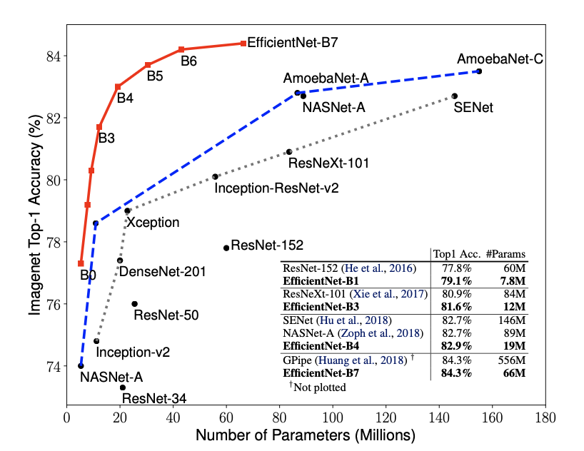
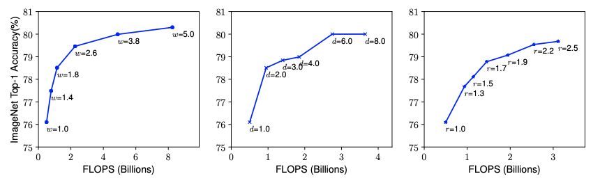

# Báo cáo Efficient Net - Google AI

## Mục lục
- [Giới thiệu](#giới-thiệu)
- [Kiến trúc EfficientNet](#kiến-trúc-EfficientNet)
- [Thực nghiệm](#thực-nghiệm)
- [Kết luận](#kết-luận)

## Giới thiệu
### Mô hình ConvNet
- ResNet có thể mở rộng bằng tăng depth
- WideResNet, MobileNet mở rộng bằng cách tăng width

### Mô hình EfficientNet
- Mô hình CNN do Google AI phát triển năm 2019
- Mục tiêu: đạt độ chính xác cao trên ImageNet nhưng vẫn giảm số lượng tham số và tốc độ tính toán
- Ý tưởng: mở rộng đồng thời depth, width and resolution theo tỉ lệ tối ưu thay vì tăng riêng lẻ

## Kiến trúc EfficientNet
### Scaling Dimensions
- Depth: mạng sâu hơn có thể học đặc trưng phức tạp hơn, tổng quát hoá tốt hơn cho các tác vụ mới nhưng càng sâu thì càng khó huấn luyện và hiệu quả tăng độ chính xác sẽ giảm 
- Width: mạng rộng hơn dễ huấn luyện, học nhiều đặc trưng chi tiết hơn nhưng nếu quá rộng mà khồn đủ sâu thì mô hình sẽ khó học đặc trưng cấp cao. Độ chính xác cũng nhanh chóng bão hoà khi w tăng quá lớn
- Resolution: tăng độ phân giải giúp mô hình học được các đặc trưng chi tiết hơn, nhưng hiệu quả tăng độ chính xác sẽ giảm dần khi r quá lớn 

 → Chỉ mở rộng một chiều sẽ không tối ưu, cần cân bằng cả ba để tăng hiệu quả và độ chính xác

### Compound Scaling
- Mở rộng depth, width và resolution theo các hệ số cố định ⍺, β, Ɣ (const)

**Công thức mở rộng EfficientNet:**
- Depth: d = α^φ
- Width: w = β^φ
- Resolution: r = γ^φ

**Ràng buộc:**
- α · β² · γ² ≈ 2
- α ≥ 1, β ≥ 1, γ ≥ 1

### Cách thiết kế EfficientNet-B0
- Sử dụng các khối MBConv từ MobileNetV2 và Squeeze-and-Excitation để tăng hiệu quả
- Được tìm ra bằng Neural Architecture Search (sử dụng thuật toán để thử nghiệm và chọn ra kiến trúc mạng tốt nhất về độ chính xác, tốc độ hoặc hiệu quả tài nguyên)
- Mở rộng mô hình lên B1-7 bằng 2 cách: thay đổi 1 là φ, 2 là bộ số ⍺, β, Ɣ
- Mô hình B6, B7 đòi hỏi GPU/TPU mạng

## Thực nghiệm
- Thiết lập
    - Dataset: ImageNet (1.2 triệu ảnh huấn luyện, 50k ảnh validation).
    - Môi trường: TPU v3-8, batch size 4096, optimizer RMSProp, learning rate decay.
    - Huấn luyện: EfficientNet-B0 huấn luyện ~350 epochs.

- Kết quả
    - Top 1 Accuracy trên ImageNet
        | B0  | B4  | B7  |
        |-----|-----|-----|
        |77.1%|83.0%|84.4%|

## Kết luận 
- So với các mô hình khác, EfficientNet đạt state-of-the-art trên ImageNet với tham số ít hơn 10-20 lần so với ResNet/ResNeXt
- Hiệu quả accuracy/parameter của EfficientNet cao nhất trong các CNN cùng thời điểm
- Hiệu quả cao, khả năng mở rộng linh hoạt (mô hình nhỏ B0 cho mobile → B7 cho server)
- Gọn hơn ResNet nhưng tham số vẫn cao so với MobileNet, NAS ban đầu phức tạp và tốn tài nguyên

