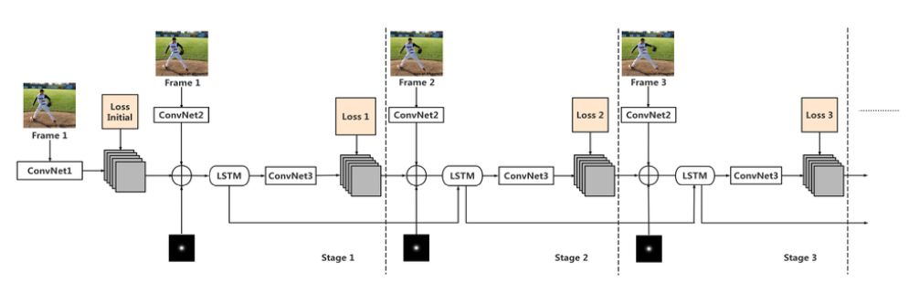
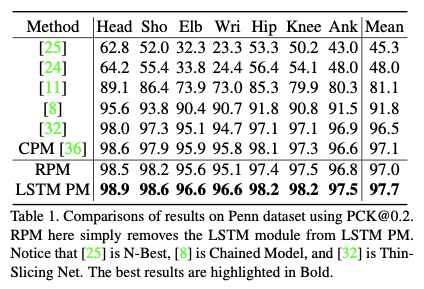
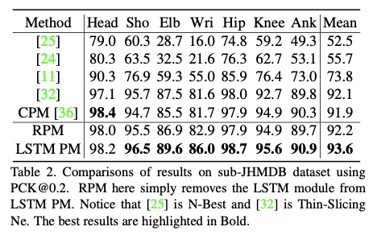

# Báo cáo LSTM Pose Machines

## Mục lục
- [Giới thiệu](#1-giới-thiệu)
- [Đóng góp chính](#2-đóng-góp-chính)
- [Kiến trúc mô hình](#3-kiến-trúc-mô-hình)
- [LSTM Model](#4-lstm-module) 
- [Thực nghiêm](#5-thực-nghiệm)

## 1. Giới thiệu
- Bài toán ước lượng tư thế người (pose estimation) trong video. Multi-stage CNN được dùng chủ yếu và đạt kết quả tốt trên, nhưng khi áp dụng cho video thì gặp nhiều hạn chế:
	- Tốn tài nguyên tính toán
    - Hiệu suất giảm, kết quả bị giật 
    - Không ổn định

- Nguyên nhân: 
    - Không đảm bảo tính nhất quán giữa các khung hình liên tiếp
    - Không xử lý tốt việc chuyển động, che khuất
    - Không khai thác mối liên hệ thời gian của các khung hình

- Ý tưởng: đề xuất sử dụng LSTM + CNN
    - Nếu chia sẻ trọng số giữa các CNN thì có thể viết lại thành RNN
    - RNN giúp kết nối thông tin nhiều khung hình, tăng tốc độ xử lý và cải thiện độ ổn định của kết quả
    - LSTM giúp lưu trữ thông tin lâu dài của frame, xử lý tốt các vấn đề (chuyển động nhanh, mờ, bị khuất)

## 2. Đóng góp chính
- Xây dựng kiến trúc hồi quy mới kết hợp LSTM để nắm bắt mối quan hệ hình học và thời gian giữa các khung hình video. Mô hình vượt qua các phương pháp hiện tại trên hai bộ dữ liệu lớn.
- Kiến trúc mới tách biệt mối quan hệ giữa các giai đoạn mạng, giúp tăng tốc độ xử lý video.
- Phân tích chi tiết bên trong ô nhớ LSTM, chỉ ra cách nó giúp cải thiện dự đoán khớp trong video.

## 3. Kiến trúc mô hình
- Bước 1: Từ CNN nhiều giai đoạn (Convolutional Pose Machine – CPM), áp dụng chia sẻ trọng số để biến thành dạng hồi quy.
- Bước 2: Đưa LSTM vào giữa bộ trích xuất đặc trưng và bộ sinh dự đoán.
- Bước 3: Với mỗi khung hình video, mô hình sinh ra bản đồ xác suất (heatmap) các khớp → đảm bảo tính ổn định theo chuỗi.

## 4. LSTM Module 
- LSTM module: sử dụng ConvLSTM với các cổng (input, forget, output) → lưu trữ và cập nhật thông tin theo thời gian.
- Sử dụng element-wise + convolution thay vì nhân ma trận 
- → Nhớ được thông tin lâu dài, đặc biệt hữu ích khi khớp bị che khuất hoặc chuyển động nhanh

## 5. Thực nghiệm
- Bộ dữ liệu
	- Penn Action: 2326 video, mỗi video ~70 khung, 13 khớp người được gán nhãn.
	- Sub-JHMDB: 316 video, 11200 khung, đầy đủ khớp cơ thể.

- Kết quả
	- Trên cả Penn Action và sub-JHMDB, LSTM Pose Machines vượt trội so với các phương pháp trước (CPM, Thin-Slicing Net, Chained Model…).
	- Độ chính xác tăng mạnh ở các khớp tay, cổ tay, khuỷu tay – vốn thường chịu ảnh hưởng nhiều bởi chuyển động nhanh và che khuất.
	- Tốc độ xử lý: 25.6 ms/frame, nhanh gấp ~2 lần so với CPM (48.4 ms/frame).

  
  

 

- Phân tích LSTM

	- LSTM lưu giữ được thông tin khung trước để dự đoán chính xác khớp trong khung sau ngay cả khi bị che khuất.
	- Ô nhớ học được cả thông tin toàn cục (toàn thân) và cục bộ (khớp riêng lẻ).
	- Nhờ đó, kết quả ổn định và giảm sai sót khi khung hình thay đổi nhanh.

## 5. Kết luận
- Mô hình LSTM Pose Machines khắc phục nhược điểm của CNN truyền thống khi áp dụng cho video:
	- Tăng độ ổn định.
	- Cải thiện chính xác, đặc biệt ở các khớp chuyển động nhanh.
	- Rút ngắn thời gian suy luận → phù hợp cho ứng dụng thời gian thực.
	- Tuy vẫn còn hạn chế khi khớp bị che khuất trong thời gian dài, nhưng nghiên cứu đã chứng minh hiệu quả rõ rệt của việc kết hợp Pose Estimation + LSTM.

