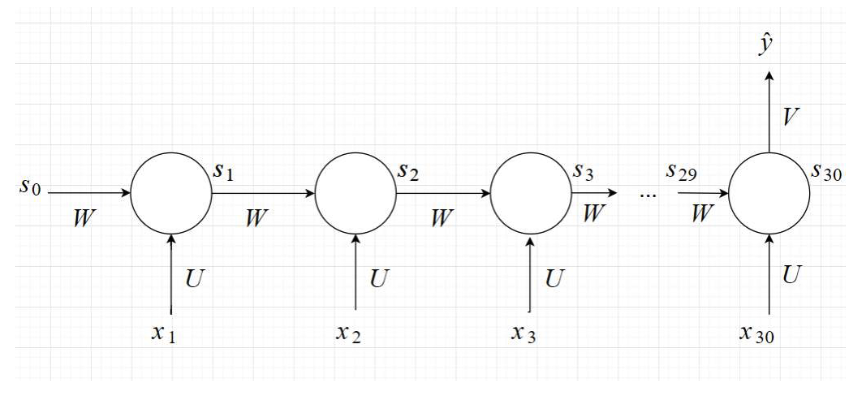
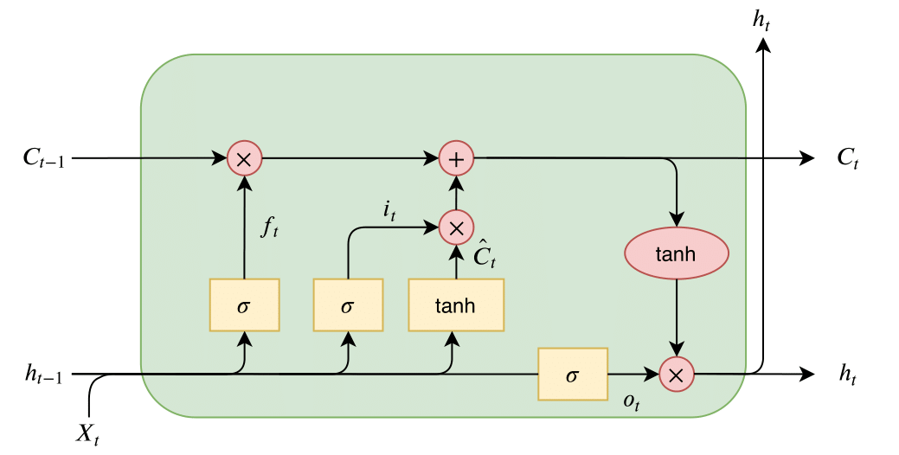

# Báo cáo Recurrent Neural Network (RNN) và Long Short Term Memory (LSTM)

## Mục lục
- [Giới thiệu RNN](#giới-thiệu-RNN)
- [Giới thiệu LSTM](#giới-thiệu-LSTM)
- [Kiến trúc LSTM](#kiến-trúc-lstm)

## Giới thiệu RNN
- Là mạng được thiết kế để xử lý dữ liệu input là data sequence (video,...)
- Có vòng lặp cho phép thông tin được truyền từ bước trước đến bước sau
- Hạn chế: không học được từ các thông tin ở trước đó xa do bị varnishing gradient

## Giới thiệu LSTM
- Được tạo ra để khắc phục hạn chế varnishing gradient của RNN
- Lưu giữ thông tin ngắn hạn + dài hạn → phù hợp vs dữ liệu sequence dài

## Kiến trúc LSTM
- Ở state thứ t:
    - Input: c(t-1), h(t-1), xt. Trong đó xt là input ở state thứ t, c(t-1), h(t-1) là output của layer trước
    - Output: ct(long-term memory), ht(short-term memory)

